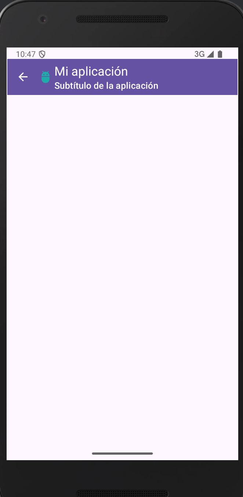

# ToolBar - Menú de puntos

## 1️⃣  Preparamos el proyecto para uso de binding.

```kotlin
    buildFeatures {
        viewBinding = true
    }
```

Y sincronizamos.

## 2️⃣ Añadimos en el laayout de la MainActivity una MaterialToolbar (la podemos encontrar en containers).


```xml
<?xml version="1.0" encoding="utf-8"?>
<androidx.constraintlayout.widget.ConstraintLayout xmlns:android="http://schemas.android.com/apk/res/android"
    xmlns:app="http://schemas.android.com/apk/res-auto"
    xmlns:tools="http://schemas.android.com/tools"
    android:id="@+id/main"
    android:layout_width="match_parent"
    android:layout_height="match_parent"
    tools:context=".MainActivity">

    <com.google.android.material.appbar.MaterialToolbar
        android:id="@+id/toolbar"
        android:layout_width="409dp"
        android:layout_height="wrap_content"
        android:layout_marginTop="20dp"
        android:background="?attr/colorPrimary"
        android:minHeight="?attr/actionBarSize"
        android:theme="?attr/actionBarTheme"
        app:layout_constraintBottom_toBottomOf="parent"
        app:layout_constraintEnd_toEndOf="parent"
        app:layout_constraintStart_toStartOf="parent"
        app:layout_constraintTop_toTopOf="parent"
        app:popupTheme="@style/ThemeOverlay.AppCompat.Light"
        app:theme="@style/ThemeOverlay.AppCompat.Dark.ActionBar"
        app:layout_constraintVertical_bias="0.0" />
</androidx.constraintlayout.widget.ConstraintLayout>
```

Encontramos más información en la documentación:

https://m3.material.io/components/toolbars/overview

## 3️⃣ Lanzamos desde ***MainActivity.kt*** la ventana y la *toolbar* con el código:


```kotlin
class MainActivity : AppCompatActivity() {
    private lateinit var binding: ActivityMainBinding
    private lateinit var appBarConfiguration: AppBarConfiguration

    override fun onCreate(savedInstanceState: Bundle?) {
        super.onCreate(savedInstanceState)
        enableEdgeToEdge()
        binding = ActivityMainBinding.inflate(layoutInflater)
        setContentView(binding.root)
//        setContentView(R.layout.activity_main)

        binding.toolbar.title = "Mi aplicación"
        binding.toolbar.subtitle = "Subtítulo de la aplicación"
        binding.toolbar.setLogo(R.drawable.ic_logo)
        setSupportActionBar(binding.toolbar)
        supportActionBar?.setDisplayHomeAsUpEnabled(true)

        binding.toolbar.setNavigationOnClickListener {
            Toast.makeText(this,"Pulsado el retroceso", Toast.LENGTH_SHORT).show()
        }

    }
}
```

Con lo anterior se verá la ***ToolBar*** con la opción de retroceso activada.




## 4️⃣ Vamos a crear el menú de puntos que anclaremos a la Toolbar.


Necesitamos un **Android Resource File** de tipo menú:


En el menú XML que me crea ponemos las opciones:

```xml
<?xml version="1.0" encoding="utf-8"?>
<menu xmlns:android="http://schemas.android.com/apk/res/android"
    xmlns:app="http://schemas.android.com/apk/res-auto">
    <item
        android:id="@+id/mnOp1"
        android:icon="@drawable/ic_opcion1"
        android:title="Opción 1"
        app:showAsAction="always"
        />
    <item
        android:id="@+id/mnOp2"
        android:icon="@drawable/ic_opcion2"
        android:title="Opción 2"
        app:showAsAction="ifRoom"
        />
</menu>
```

Las imágenes las añadimos del generador de imágenes de **Android Studio - Vector Asset:**


Generamos dos con los nombres `ic_opcion1` e `ic_opcion2`.

## 5️⃣ Lanzamos el menú.


Para poder usar el menú lanzamos el evento que lo ‘*pintará’* y el que pondrá los ***listener*** de las opciones:

```kotlin
class MainActivity : AppCompatActivity() {
    private lateinit var binding: ActivityMainBinding
    private lateinit var appBarConfiguration: AppBarConfiguration

    override fun onCreate(savedInstanceState: Bundle?) {
        super.onCreate(savedInstanceState)
        enableEdgeToEdge()
        binding = ActivityMainBinding.inflate(layoutInflater)
        setContentView(binding.root)
//        setContentView(R.layout.activity_main)

        binding.toolbar.title = "Mi aplicación"
        binding.toolbar.subtitle = "Subtítulo de la aplicación"
        binding.toolbar.setLogo(R.drawable.ic_logo)
        setSupportActionBar(binding.toolbar)
        supportActionBar?.setDisplayHomeAsUpEnabled(true)

        binding.toolbar.setNavigationOnClickListener {
            Toast.makeText(this,"Pulsado el retroceso", Toast.LENGTH_SHORT).show()
        }

    }

    //************************* Funciones auxiliares para los menú de puntos *****************************
    override fun onCreateOptionsMenu(menu: Menu?): Boolean {
        menuInflater.inflate(R.menu.menu, menu)
        return super.onCreateOptionsMenu(menu)
    }

    override fun onOptionsItemSelected(item: MenuItem): Boolean {
        when(item.itemId){
            R.id.mnOp1 -> {
                Toast.makeText(this, "Opción 1", Toast.LENGTH_SHORT).show()
            }
            R.id.mnOp2 -> {
                Toast.makeText(this, "Opción 2", Toast.LENGTH_SHORT).show()
            }
        }
        return super.onOptionsItemSelected(item)
    }
}
```

Quedando así la app:


Jugando con las opciones de menú shoAsAction podemos hacer que s emuestren iconos o el clásico menú de puntos:

```xml
<?xml version="1.0" encoding="utf-8"?>
<menu xmlns:android="http://schemas.android.com/apk/res/android"
    xmlns:app="http://schemas.android.com/apk/res-auto">
    <item
        android:id="@+id/mnOp1"
        android:icon="@drawable/ic_opcion1"
        android:title="Opción 1"
        app:showAsAction="never"
        />
    <item
        android:id="@+id/mnOp2"
        android:icon="@drawable/ic_opcion2"
        android:title="Opción 2"
        app:showAsAction="never"
        />
</menu>
```

De esta manera:

